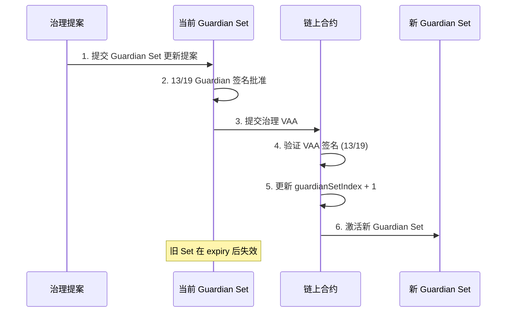

# 多签跨链桥技术调研报告

> 文档版本: v1.0  
> 创建日期: 2025-11-06  
> 参考架构: Wormhole Protocol

---

## 目录

1. [概述](#1-概述)
2. [技术栈调研](#2-技术栈调研)
3. [核心组件设计](#3-核心组件设计)
4. [链上事件监听方案](#4-链上事件监听方案)
5. [密码学方案](#5-密码学方案)
6. [部署架构](#6-部署架构)
7. [开发路线图](#7-开发路线图)

---

## 1. 概述

### 1.1 项目目标

构建一个基于多签验证的跨链桥系统,支持 EVM 链与 Solana 链之间的消息传递和资产转移。

### 1.2 核心特性

- ✅ **多签安全**: 19 个 Guardian 节点,13/19 签名阈值 (68%+ 共识)
- ✅ **双链支持**: EVM (Ethereum/Anvil) ⟷ Solana (Solana Test Validator)
- ✅ **去信任中继**: 用户手动中继 VAA,无需信任中继节点
- ✅ **模块化设计**: 预留 Executor 网络接口
- ✅ **Rust 优先**: 除 EVM 合约外尽可能使用 Rust

---

## 2. 技术栈调研

### 2.1 编程语言与框架

| 组件 | 技术选型 | 理由 |
|------|---------|------|
| **EVM 合约** | Solidity + Foundry | 行业标准,测试框架完善 |
| **Solana 合约** | Rust + Anchor v0.29.0 | Solana 官方推荐框架,类型安全 |
| **Guardian 节点** | Rust (Tokio 异步) | 高性能,内存安全,丰富的异步生态 |
| **Relayer 工具** | Rust + Clap CLI | 与 Guardian 共享代码,统一技术栈 |
| **测试脚本** | TypeScript + Ethers.js / Anchor TS | 生态成熟,便于集成测试 |

### 2.2 本地测试节点

#### EVM 链: Foundry Anvil

```bash
# 启动本地测试网
anvil --host 0.0.0.0 --port 8545

# 特性
- ✅ 即时出块 (instant mining)
- ✅ 预设测试账户 (10 ETH each)
- ✅ 支持快照/回滚
- ✅ Foundry 原生集成
```

#### Solana 链: Solana Test Validator

```bash
# 启动本地测试网
solana-test-validator \
  --rpc-port 8899 \
  --faucet-port 9900 \
  --ledger /tmp/test-ledger

# 特性
- ✅ 本地 POH 时钟
- ✅ 内置 Faucet (空投 SOL)
- ✅ 支持 WebSocket RPC 订阅
- ✅ Anchor 原生支持
```

### 2.3 依赖库调研

#### Rust 生态

| 库名 | 用途 | 版本 |
|------|------|------|
| `tokio` | 异步运行时 | 1.35+ |
| `ethers-rs` | EVM 交互 | 2.0+ |
| `solana-client` | Solana RPC 客户端 | 1.18+ |
| `solana-client` | RPC/WebSocket 客户端 | 1.18+ |
| `secp256k1` | ECDSA 签名 | 0.28+ |
| `sha3` | Keccak256 哈希 | 0.10+ |
| `clap` | CLI 参数解析 | 4.5+ |
| `serde` | 序列化/反序列化 | 1.0+ |
| `tracing` | 日志系统 | 0.1+ |

#### Solana Anchor

```toml
[dependencies]
anchor-lang = "0.29.0"
anchor-spl = "0.29.0"
solana-program = "1.18"
```

#### EVM Foundry

```toml
[dependencies]
forge-std = "^1.7.0"
openzeppelin-contracts = "5.0.0"
```

---

## 3. 核心组件设计

### 3.1 架构概览

```
┌─────────────────────────────────────────────────────────────┐
│                        用户层                                │
│  DApp Frontend ──► Wallet ──► Submit Transaction            │
└────────────────────────┬────────────────────────────────────┘
                         │
┌────────────────────────▼────────────────────────────────────┐
│                      合约层                                  │
│  ┌─────────────┐              ┌─────────────┐              │
│  │ EVM Core    │◄────VAA────►│ Solana Core │              │
│  │ Contract    │              │ Program     │              │
│  └─────────────┘              └─────────────┘              │
└────────────────────────┬────────────────────────────────────┘
                         │ emit Events
┌────────────────────────▼────────────────────────────────────┐
│                   事件监听层                                 │
│  ┌──────────────┐           ┌──────────────┐               │
│  │ EVM Watcher  │           │Solana Watcher│               │
│  │ (ethers-rs)  │           │ (Solana)     │               │
│  └──────────────┘           └──────────────┘               │
└────────────────────────┬────────────────────────────────────┘
                         │ publish Messages
┌────────────────────────▼────────────────────────────────────┐
│                Guardian 网络 (P2P gossip)                    │
│  ┌──────┐ ┌──────┐ ┌──────┐     ┌──────┐ ┌──────┐         │
│  │ G-1  │ │ G-2  │ │ G-3  │ ... │ G-18 │ │ G-19 │         │
│  └──────┘ └──────┘ └──────┘     └──────┘ └──────┘         │
│      │       │       │             │       │                │
│      └───────┴───────┴─────────────┴───────┘                │
│                      ▼                                       │
│          Aggregate Signatures (13/19 quorum)                │
│                      ▼                                       │
│                  生成 VAA                                    │
└────────────────────────┬────────────────────────────────────┘
                         │
┌────────────────────────▼────────────────────────────────────┐
│                    中继层                                    │
│  ┌──────────────────────────────────────────────────┐       │
│  │  用户手动中继 (MVP)                               │       │
│  │  1. 从 Guardian API 获取 VAA                      │       │
│  │  2. 提交到目标链合约                              │       │
│  └──────────────────────────────────────────────────┘       │
│                                                              │
│  ┌──────────────────────────────────────────────────┐       │
│  │  预留: Executor 网络 (未来实现)                   │       │
│  │  - 去中心化自动中继                               │       │
│  │  - 报价市场                                       │       │
│  └──────────────────────────────────────────────────┘       │
└──────────────────────────────────────────────────────────────┘
```

### 3.2 组件职责

#### 3.2.1 Core Contract (EVM)

**文件**: `contracts/evm/src/CoreContract.sol`

```solidity
// 核心功能
contract CoreContract {
    // 1. 消息发送
    function publishMessage(
        uint32 nonce,
        bytes memory payload,
        uint8 consistencyLevel
    ) external payable returns (uint64 sequence);
    
    // 2. VAA 验证
    function parseAndVerifyVAA(
        bytes memory encodedVAA
    ) external view returns (VM memory vm, bool valid);
    
    // 3. Guardian Set 管理
    function updateGuardianSet(
        bytes memory newGuardianSetVAA
    ) external;
}
```

**关键数据结构**:
```solidity
struct GuardianSet {
    address[] keys;          // Guardian 公钥地址
    uint32 expirationTime;   // 过期时间
}

struct VM {  // VAA 结构
    uint8 version;
    uint32 timestamp;
    uint32 nonce;
    uint16 emitterChainId;
    bytes32 emitterAddress;
    uint64 sequence;
    uint8 consistencyLevel;
    bytes payload;
    uint32 guardianSetIndex;
    Signature[] signatures;
    bytes32 hash;
}
```

#### 3.2.2 Core Program (Solana)

**文件**: `programs/solana-core/src/lib.rs`

```rust
use anchor_lang::prelude::*;

#[program]
pub mod solana_core {
    // 1. 消息发送
    pub fn post_message(
        ctx: Context<PostMessage>,
        nonce: u32,
        payload: Vec<u8>,
        consistency_level: u8,
    ) -> Result<()>;
    
    // 2. VAA 验证
    pub fn verify_signatures(
        ctx: Context<VerifySignatures>,
        guardian_set_index: u32,
        hash: [u8; 32],
        signatures: Vec<Signature>,
    ) -> Result<()>;
    
    // 3. 发布 VAA
    pub fn post_vaa(
        ctx: Context<PostVAA>,
        vaa: PostedVAA,
    ) -> Result<()>;
}
```

**核心账户**:
```rust
#[account]
pub struct Bridge {
    pub guardian_set_index: u32,
    pub config: BridgeConfig,
}

#[account]
pub struct GuardianSet {
    pub index: u32,
    pub keys: Vec<[u8; 20]>,  // Ethereum 地址格式
    pub creation_time: i64,
    pub expiration_time: u32,
}

#[account]
pub struct PostedMessage {
    pub consistency_level: u8,
    pub emitter_chain: u16,
    pub emitter_address: [u8; 32],
    pub sequence: u64,
    pub payload: Vec<u8>,
}
```

#### 3.2.3 Guardian Node

**文件**: `guardian/src/main.rs`

```rust
// 核心逻辑
pub struct GuardianNode {
    // 配置
    config: GuardianConfig,
    
    // 密钥管理
    signing_key: SecretKey,
    
    // 网络层
    p2p_network: P2PNetwork,
    
    // 观察者
    evm_watcher: EvmWatcher,
    solana_watcher: SolanaWatcher,
    
    // VAA 聚合器
    vaa_aggregator: VAAggregator,
}

impl GuardianNode {
    // 1. 监听链上事件
    async fn watch_chains(&self) -> Result<()>;
    
    // 2. 对消息签名
    async fn sign_observation(&self, msg: &Message) -> Signature;
    
    // 3. 广播签名
    async fn broadcast_signature(&self, sig: Signature) -> Result<()>;
    
    // 4. 聚合签名生成 VAA
    async fn aggregate_signatures(&self, msg: &Message) -> Option<VAA>;
}
```

**P2P 网络设计**:
- 使用 `libp2p` 库实现 Gossipsub 协议
- 每个 Guardian 维护与其他节点的连接
- 签名通过 Gossip 协议广播

---

## 4. 链上事件监听方案

### 4.1 EVM 链监听 (ethers-rs)

#### 4.1.1 WebSocket 订阅

```rust
use ethers::{
    prelude::*,
    providers::{Provider, Ws},
};

pub struct EvmWatcher {
    provider: Provider<Ws>,
    core_contract_address: Address,
}

impl EvmWatcher {
    pub async fn watch_messages(&self) -> Result<()> {
        let contract = CoreContract::new(
            self.core_contract_address,
            self.provider.clone()
        );
        
        // 订阅 LogMessagePublished 事件
        let filter = contract
            .event::<LogMessagePublishedFilter>()
            .from_block(0);
        
        let mut stream = filter.stream().await?;
        
        while let Some(Ok(event)) = stream.next().await {
            self.handle_message(event).await?;
        }
        
        Ok(())
    }
}
```

#### 4.1.2 事件结构

```solidity
event LogMessagePublished(
    address indexed sender,
    uint64 sequence,
    uint32 nonce,
    bytes payload,
    uint8 consistencyLevel
);
```

### 4.2 Solana 链监听 (WebSocket Logs 订阅)

#### 4.2.1 主流方案选择

**推荐**: WebSocket `logsSubscribe` (Wormhole 实际采用)

根据 Wormhole 实际架构,Solana 事件监听采用 **WebSocket 日志订阅**,而非 Geyser Plugin。

#### Wormhole 实际监听机制

Wormhole 使用 **两种模式** 在 Solana 上监听事件:

**1. 传统模式 (Legacy)** - 已过时
- 消息存储在链上账户
- Guardian 读取账户数据
- 成本高(租金 + 计算)

**2. Shim 模式 (生产环境)** - 当前使用
- 消息通过 **CPI 事件发送到交易日志**
- Guardian 从 **WebSocket 交易日志流** 中读取
- 仅计算成本,无需租金
- 数据保留至 RPC 历史清理

**技术细节**:
```rust
// Wormhole Emission Shim 发送消息流程:
Solana Program
    ↓ post_message()
Emission Shim (EtZMZM22ViKMo4r5y4Anovs3wKQ2owUmDpjygnMMcdEX)
    ↓ 发出 Anchor CPI 事件到交易日志
Guardian WebSocket Listener
    ↓ 从 logsSubscribe 流中读取
解析 instruction data + event payload
    ↓
生成 VAA
```

| 方案 | 延迟 | 复杂度 | 部署要求 | 适用场景 |
|------|------|--------|----------|----------|
| **WebSocket Logs** ⭐ | ~100ms | 低 | 仅需 RPC 节点 | **主流方案,推荐** |
| Spy + gRPC | ~100ms | 中 | 需额外组件 | 分布式 Guardian |
| Geyser Plugin | <10ms | 极高 | 需修改验证器 | 极致性能(不推荐) |
| RPC 轮询 | ~500ms | 低 | 仅需 RPC | 不推荐 |

**为什么选择 WebSocket?**
- ✅ 无需修改 Solana 验证器配置
- ✅ 延迟完全可接受 (~100ms vs Geyser 的 <10ms)
- ✅ 实现简单,易于调试和维护
- ✅ **Wormhole 生产环境实际使用**
- ✅ 标准 Solana RPC 接口,稳定性高
- ✅ **Guardian 直接从交易日志读取事件** (与 EVM 的 event log 机制类似)

#### 4.2.2 WebSocket 实现

**文件**: `guardian/solana-watcher/src/lib.rs`

```rust
use solana_client::{
    nonblocking::pubsub_client::PubsubClient,
    rpc_config::{RpcTransactionLogsConfig, RpcTransactionLogsFilter},
};
use solana_sdk::{commitment_config::CommitmentConfig, pubkey::Pubkey};
use tokio_stream::StreamExt;

pub struct SolanaWatcher {
    pubsub_url: String,
    core_program_id: Pubkey,
    event_sender: tokio::sync::mpsc::Sender<Observation>,
}

impl SolanaWatcher {
    pub async fn run(&self) -> Result<()> {
        let pubsub_client = PubsubClient::new(&self.pubsub_url).await?;
        
        // 订阅 Core Program 的日志
        let (mut stream, _unsubscribe) = pubsub_client
            .logs_subscribe(
                RpcTransactionLogsFilter::Mentions(vec![
                    self.core_program_id.to_string()
                ]),
                Some(RpcTransactionLogsConfig {
                    commitment: Some(CommitmentConfig::confirmed()),
                }),
            )
            .await?;
        
        info!("Solana watcher started, listening to {}", self.core_program_id);
        
        // 处理日志事件流
        while let Some(response) = stream.next().await {
            let logs = response.value.logs;
            let signature = response.value.signature;
            let slot = response.context.slot;
            
            // 解析消息发布事件
            if let Some(observation) = self.parse_message_logs(&logs, &signature, slot).await? {
                self.event_sender.send(observation).await?;
            }
        }
        
        Ok(())
    }
    
    async fn parse_message_logs(
        &self,
        logs: &[String],
        signature: &str,
        slot: u64,
    ) -> Result<Option<Observation>> {
        for log in logs {
            // Solana 程序日志格式: "Program data: <base64_encoded_data>"
            if let Some(data_str) = log.strip_prefix("Program data: ") {
                let data = base64::decode(data_str)?;
                
                // 解析 PostedMessage 数据结构
                let message = PostedMessage::try_from_slice(&data)?;
                
                return Ok(Some(Observation {
                    emitter_chain: CHAIN_ID_SOLANA,
                    emitter_address: message.emitter_address,
                    sequence: message.sequence,
                    tx_hash: signature.parse()?,
                    slot,
                    timestamp: std::time::SystemTime::now()
                        .duration_since(UNIX_EPOCH)?
                        .as_secs() as u32,
                    payload: message.payload,
                    consistency_level: message.consistency_level,
                }));
            }
        }
        Ok(None)
    }
}
```

**关键优势**:
- 📡 **实时性**: 确认区块后立即推送 (~100ms)
- 🔍 **过滤能力**: 只订阅 Core Program 的日志,避免无关数据
- 💪 **可靠性**: WebSocket 断线自动重连
- 📊 **完整信息**: 包含 signature, slot, 交易日志

#### 4.2.3 配置示例

**文件**: `guardian/configs/guardian-1.yaml`

```yaml
solana:
  rpc_url: "http://localhost:8899"
  ws_url: "ws://localhost:8900"  # WebSocket 端点
  core_program_id: "Core11111111111111111111111111111111111111"
  commitment: "confirmed"  # 确认级别: processed | confirmed | finalized
```

#### 4.2.4 启动配置

```bash
# 启动 Solana 测试验证节点
solana-test-validator \
  --rpc-port 8899 \
  --ws-port 8900
```

### 4.3 事件监听对比

| 方案 | EVM (ethers-rs) | Solana (WebSocket) |
|------|-----------------|-------------------|
| **实现方式** | WebSocket 订阅事件 | WebSocket 订阅交易日志 |
| **延迟** | ~100ms (区块确认) | ~100ms (确认级别) |
| **稳定性** | 依赖 RPC 节点 | 依赖 RPC 节点 |
| **资源占用** | 低 | 低 |
| **开发复杂度** | 简单 | 简单 |
| **生产就绪** | ✅ 主流方案 | ✅ Wormhole 生产方案 |

**关键区别说明**:

**EVM 链**:
- 智能合约 `emit Event` → 存储在区块的 logs 字段
- Guardian 通过 `eth_subscribe("logs")` 监听
- 事件永久保存在链上

**Solana 链 (Wormhole 方式)**:
- 程序通过 **Emission Shim** 发出 CPI 事件到交易日志
- Guardian 通过 `logsSubscribe` 监听交易日志
- 日志保留在 RPC 历史中(非永久链上存储)
- 优势: **节省租金成本,避免链上状态膨胀**

两种方式的监听机制本质相同:都是通过 WebSocket 实时订阅链上日志流。

---

## 5. 密码学方案

### 5.1 签名算法: ECDSA (secp256k1)

与 Wormhole 保持一致,使用 secp256k1 曲线的 ECDSA 签名。

#### 5.1.1 密钥生成

```rust
use secp256k1::{Secp256k1, SecretKey, PublicKey};
use sha3::{Keccak256, Digest};

pub struct GuardianKeys {
    secret_key: SecretKey,
    public_key: PublicKey,
    ethereum_address: [u8; 20],
}

impl GuardianKeys {
    pub fn generate() -> Self {
        let secp = Secp256k1::new();
        let (secret_key, public_key) = secp.generate_keypair(&mut rand::thread_rng());
        
        // 计算 Ethereum 地址 (Keccak256(pubkey)[12..32])
        let pubkey_bytes = public_key.serialize_uncompressed();
        let hash = Keccak256::digest(&pubkey_bytes[1..]); // 去掉 0x04 前缀
        let mut address = [0u8; 20];
        address.copy_from_slice(&hash[12..]);
        
        Self {
            secret_key,
            public_key,
            ethereum_address: address,
        }
    }
}
```

### 5.2 消息摘要计算

#### 5.2.1 EVM 链 (双重哈希)

```rust
pub fn compute_evm_digest(vaa_body: &[u8]) -> [u8; 32] {
    let hash1 = Keccak256::digest(vaa_body);
    let hash2 = Keccak256::digest(&hash1);
    hash2.into()
}
```

#### 5.2.2 Solana 链哈希方式

**Solana 也是双哈希** (之前理解有误):

```rust
pub fn compute_solana_digest(vaa_body: &[u8]) -> [u8; 32] {
    use solana_program::keccak;
    
    // 第一次: hashv (Solana 标准哈希)
    let message_hash = keccak::hashv(&[vaa_body]).to_bytes();
    
    // 第二次: 对消息哈希再哈希
    keccak::hash(&message_hash).to_bytes()
}
```

**实际 Wormhole Solana 验证代码**:
```rust
pub fn consume_vaa(
    ctx: Context<ConsumeVaa>,
    vaa_body: Vec<u8>,
) -> Result<()> {
    // 第一次哈希
    let message_hash = &solana_program::keccak::hashv(&[&vaa_body]).to_bytes();
    
    // 第二次哈希得到最终 digest
    let digest = keccak::hash(message_hash.as_slice()).to_bytes();
    
    // 用 digest 验证签名
    wormhole_verify_vaa_shim::cpi::verify_hash(
        CpiContext::new(/*...*/),
        guardian_set_bump,
        digest,
    )?;
    
    Ok(())
}
```

**跨链一致性**:
- EVM 和 Solana **都使用 keccak256 双哈希**
- 确保 VAA 可以在任意链验证
- Guardian 签名对所有链通用
```

### 5.3 签名与验证

```rust
use secp256k1::Message as SecpMessage;

pub fn sign_observation(
    secret_key: &SecretKey,
    digest: &[u8; 32],
) -> Result<Signature> {
    let secp = Secp256k1::new();
    let msg = SecpMessage::from_slice(digest)?;
    let sig = secp.sign_ecdsa(&msg, secret_key);
    
    Ok(Signature {
        r: sig.serialize_compact()[..32].try_into()?,
        s: sig.serialize_compact()[32..].try_into()?,
        v: 27, // Recovery ID
    })
}

pub fn verify_signature(
    guardian_address: &[u8; 20],
    digest: &[u8; 32],
    signature: &Signature,
) -> bool {
    // 从签名恢复公钥
    let recovered_pubkey = recover_pubkey(digest, signature).ok()?;
    
    // 计算地址并比对
    let recovered_address = pubkey_to_address(&recovered_pubkey);
    
    recovered_address == *guardian_address
}
```

### 5.4 多签聚合

```rust
pub struct VAAggregator {
    required_signatures: usize, // 13
    total_guardians: usize,      // 19
}

impl VAAggregator {
    pub fn aggregate(
        &self,
        message: &Message,
        signatures: Vec<(GuardianIndex, Signature)>,
    ) -> Option<VAA> {
        // 1. 验证签名数量
        if signatures.len() < self.required_signatures {
            return None;
        }
        
        // 2. 验证每个签名
        let valid_sigs: Vec<_> = signatures
            .into_iter()
            .filter(|(idx, sig)| {
                let guardian = &self.guardian_set[*idx];
                verify_signature(&guardian.address, &message.digest, sig)
            })
            .take(self.required_signatures) // 只取前13个有效签名
            .collect();
        
        if valid_sigs.len() < self.required_signatures {
            return None;
        }
        
        // 3. 构造 VAA
        Some(VAA {
            version: 1,
            guardian_set_index: self.current_guardian_set_index,
            signatures: valid_sigs,
            timestamp: message.timestamp,
            nonce: message.nonce,
            emitter_chain: message.emitter_chain,
            emitter_address: message.emitter_address,
            sequence: message.sequence,
            consistency_level: message.consistency_level,
            payload: message.payload.clone(),
        })
    }
}
```

---

## 6. Guardian 网络治理与权限

### 6.1 Permissioned vs Permissionless

**关键区别**:

| 组件 | 权限模式 | 成员数量 | 谁可以参与? |
|------|---------|---------|------------|
| **Guardian Network** | ❌ **Permissioned** | 固定 19 个 | 需通过治理投票 |
| **Relayer Network** | ✅ **Permissionless** | 无限制 | 任何人都可以 |

#### 6.1.1 为什么 Guardian 需要授权?

Wormhole (和我们的桥) 采用 **Permissioned Guardian** 模型:

```
安全性考量:
├── Guardian 掌握签名权 → 直接影响跨链安全
├── 需要高可用性和可靠性 → 运营商需要技术能力
├── 抗审查和去中心化 → 分散在多个地理位置和实体
└── 责任追溯 → 已知实体便于问责
```

**Wormhole 主网 19 个 Guardian 运营商**:
- Jump Crypto
- xLabs
- Certus One
- Staked
- Figment
- ChainodeTech
- ... (等知名验证节点运营商)

#### 6.1.2 Guardian Set 治理机制

**初始化** (部署时):

```solidity
// EVM Core Contract 初始化
function initialize(
    address[] memory initialGuardians,
    uint16 chainId,
    uint16 governanceChainId,
    bytes32 governanceContract
) public initializer {
    require(initialGuardians.length == 19, "Must have 19 guardians");
    
    GuardianSet memory set = GuardianSet({
        keys: initialGuardians,
        expirationTime: 0  // 永不过期 (直到被替换)
    });
    
    guardianSets[0] = set;
    guardianSetIndex = 0;
}
```

**治理更新流程**:



**链上治理验证**:
```solidity
function submitNewGuardianSet(bytes memory encodedVAA) public {
    // 1. 解析治理 VAA
    (IWormhole.VM memory vm, bool valid, string memory reason) = 
        wormhole.parseAndVerifyVM(encodedVAA);
    
    require(valid, reason);
    
    // 2. 验证这是治理消息
    require(
        vm.emitterChainId == governanceChainId &&
        vm.emitterAddress == governanceContract,
        "Invalid governance source"
    );
    
    // 3. 解析新 Guardian 公钥
    GuardianSetUpgrade memory upgrade = parseGuardianSetUpgrade(vm.payload);
    
    // 4. 防止重放攻击
    require(!consumedGovernanceActions[vm.hash], "Already consumed");
    consumedGovernanceActions[vm.hash] = true;
    
    // 5. 更新 Guardian Set
    guardianSets[upgrade.newIndex] = GuardianSet({
        keys: upgrade.newGuardians,
        expirationTime: uint32(block.timestamp) + guardianSetExpiry
    });
    
    guardianSetIndex = upgrade.newIndex;
    
    emit LogGuardianSetChanged(guardianSetIndex - 1, guardianSetIndex);
}
```

### 6.2 Guardian 密钥初始化

#### 6.2.1 密钥生成 (链下)

每个 Guardian **独立生成密钥对**,项目方**不持有私钥**:

```rust
use secp256k1::{Secp256k1, SecretKey, PublicKey};
use sha3::{Keccak256, Digest};

pub fn generate_guardian_keypair() -> (SecretKey, [u8; 20]) {
    let secp = Secp256k1::new();
    let mut rng = rand::thread_rng();
    
    // 1. 生成私钥
    let secret_key = SecretKey::new(&mut rng);
    
    // 2. 导出公钥
    let public_key = PublicKey::from_secret_key(&secp, &secret_key);
    
    // 3. 计算以太坊地址 (20字节)
    let pubkey_bytes = public_key.serialize_uncompressed();
    let hash = Keccak256::digest(&pubkey_bytes[1..]); // 去掉第一个字节 0x04
    let address: [u8; 20] = hash[12..].try_into().unwrap();
    
    (secret_key, address)
}
```

**密钥存储** (加密后保存):
```rust
// 使用密码加密私钥
pub fn save_encrypted_key(
    secret_key: &SecretKey,
    password: &str,
    output_path: &Path,
) -> Result<()> {
    let encrypted = encrypt_keystore_v3(
        secret_key.as_ref(),
        password,
        rand::thread_rng(),
    )?;
    
    fs::write(output_path, serde_json::to_string_pretty(&encrypted)?)?;
    Ok(())
}
```

#### 6.2.2 公钥注册流程

```
Step 1: 每个 Guardian 独立生成密钥
  └─> guardian-1: 0x1234...abcd (address)
  └─> guardian-2: 0x5678...ef01
  └─> ...
  └─> guardian-19: 0x9abc...4567

Step 2: Guardian 运营商提交公钥
  └─> 通过安全通道提交给项目方

Step 3: 项目方整理公钥列表
  └─> 验证数量 (19 个)
  └─> 验证格式 (20 字节地址)

Step 4: 部署合约时初始化
  └─> EVM: constructor(address[19] initialGuardians)
  └─> Solana: initialize(keys: Vec<[u8; 20]>)

Step 5: Guardian 验证链上数据
  └─> 每个 Guardian 检查自己的公钥是否正确
```

**初始化脚本示例**:
```typescript
// scripts/deploy-with-guardians.ts
const guardianAddresses = [
  "0x58076F561CC62A47087B567C86f986426dFCD000", // Guardian 1
  "0x8078e4e7c6e52ab1db8c52f5d0b8a7e147d9a000", // Guardian 2
  // ... 19 个地址
];

const coreContract = await CoreContract.deploy(
  guardianAddresses,
  CHAIN_ID_EVM,
  GOVERNANCE_CHAIN_ID,
  GOVERNANCE_CONTRACT_ADDRESS
);

console.log("Deployed with Guardian Set 0:", guardianAddresses);
```

### 6.3 我们的实现方案

**测试环境** (19 个模拟 Guardian):
- ✅ 自动生成 19 个密钥对
- ✅ 使用 Docker Compose 启动 19 个节点
- ✅ 通过环境变量注入密钥

**生产环境** (真实运营商):
- ✅ 每个运营商独立生成密钥
- ✅ 通过治理多签钱包部署合约
- ✅ 定期轮换 Guardian Set (通过治理投票)

```yaml
# guardian/config-template.yaml
guardian:
  index: ${GUARDIAN_INDEX}  # 1-19
  keystore:
    path: "/data/keys/guardian-${GUARDIAN_INDEX}.key"
    password_env: "GUARDIAN_${GUARDIAN_INDEX}_PASSWORD"
  
  governance:
    # 允许接收治理消息
    enabled: true
    # 治理链 (通常是以太坊主网)
    chain_id: 2
    # 治理合约地址
    contract: "0xGovernanceMultisig..."
```

---

## 7. 部署架构

### 6.1 本地开发环境

```
Docker Container (Ubuntu 24.04 + Docker-in-Docker)
├── Anvil (EVM 测试网)
│   └── Port: 8545
├── Solana Test Validator (WebSocket RPC)
│   ├── RPC: 8899
│   ├── WebSocket: 8900
│   └── Faucet: 9900
├── 19x Guardian Nodes (Docker Compose)
│   ├── guardian-1 (7071)
│   ├── guardian-2 (7072)
│   └── ...
│   └── guardian-19 (7089)
└── Guardian P2P Network (libp2p)
    └── Gossipsub on port 4001-4019
```

### 6.2 Guardian 节点配置

**文件**: `guardian/config.yaml`

```yaml
guardian:
  index: 1  # Guardian 索引 (1-19)
  
  # 密钥配置
  keystore:
    path: "/data/keys/guardian-1.key"
    password_env: "GUARDIAN_PASSWORD"
  
  # 网络配置
  p2p:
    listen_addr: "/ip4/0.0.0.0/tcp/4001"
    bootstrap_peers:
      - "/ip4/127.0.0.1/tcp/4002/p2p/QmGuardian2..."
      - "/ip4/127.0.0.1/tcp/4003/p2p/QmGuardian3..."
  
  # 链监听配置
  chains:
    evm:
      rpc_url: "ws://anvil:8545"
      core_contract: "0x..."
      start_block: 0
    
    solana:
      rpc_url: "http://solana-validator:8899"
      core_program: "Core11111111111111111111111111111111111111"
      ws_url: "ws://solana-validator:8900"
  
  # API 服务
  api:
    enabled: true
    listen: "0.0.0.0:7071"
    endpoints:
      - "/v1/signed_vaa/{chain}/{emitter}/{sequence}"
```

### 6.3 Docker Compose 部署

**文件**: `docker-compose.guardian.yml`

```yaml
version: '3.8'

services:
  # EVM 测试网
  anvil:
    image: ghcr.io/foundry-rs/foundry:latest
    command: anvil --host 0.0.0.0 --chain-id 1337
    ports:
      - "8545:8545"
  
  # Solana 测试网
  solana-validator:
    build: ./docker/solana
    ports:
      - "8899:8899"
      - "8900:8900"
    volumes:
      - solana-data:/solana-data
  
  # Guardian 节点 (1-19)
  guardian-1:
    build: ./guardian
    environment:
      - GUARDIAN_INDEX=1
      - RUST_LOG=info
    volumes:
      - ./guardian/configs/guardian-1.yaml:/config.yaml
      - ./data/guardian-1:/data
    ports:
      - "7071:7071"
      - "4001:4001"
  
  # ... guardian-2 to guardian-19 类似配置
```

---

## 7. 开发路线图

### Phase 1: 基础设施 (Week 1-2)

- [x] Docker 开发环境
- [ ] EVM Core Contract (Foundry)
- [ ] Solana Core Program (Anchor)
- [ ] 本地测试网启动脚本

### Phase 2: Guardian 实现 (Week 3-4)

- [ ] Guardian 节点框架 (Rust + Tokio)
- [ ] EVM Watcher (ethers-rs)
- [ ] Solana WebSocket Watcher
- [ ] P2P 网络 (libp2p)
- [ ] 签名逻辑与密钥管理

### Phase 3: VAA 系统 (Week 5)

- [ ] VAA 数据结构定义
- [ ] 签名聚合逻辑
- [ ] Guardian API 服务 (REST)
- [ ] VAA 序列化/反序列化

### Phase 4: 手动中继工具 (Week 6)

- [ ] CLI 工具 (Rust + Clap)
  - `fetch-vaa` 命令
  - `submit-vaa` 命令
- [ ] 合约 VAA 验证逻辑

### Phase 5: 集成测试 (Week 7)

- [ ] E2E 测试场景
  - EVM → Solana 消息传递
  - Solana → EVM 消息传递
- [ ] 性能测试
- [ ] 故障恢复测试

### Phase 6: 文档与优化 (Week 8)

- [ ] API 文档
- [ ] 部署文档
- [ ] 性能优化
- [ ] 安全审计准备

---

## 附录 A: 关键依赖版本

```toml
# Rust 工具链
[toolchain]
channel = "stable"
profile = "default"

# Guardian 依赖
[dependencies]
tokio = { version = "1.35", features = ["full"] }
ethers = "2.0"
solana-client = "1.18"
solana-client = { version = "1.18", features = ["async"] }
secp256k1 = { version = "0.28", features = ["recovery"] }
sha3 = "0.10"
libp2p = { version = "0.53", features = ["gossipsub", "tcp", "noise", "mplex"] }
clap = { version = "4.5", features = ["derive"] }
serde = { version = "1.0", features = ["derive"] }
serde_json = "1.0"
tracing = "0.1"
tracing-subscriber = "0.3"
```

```json
// TypeScript 依赖
{
  "devDependencies": {
    "@coral-xyz/anchor": "^0.29.0",
    "@solana/web3.js": "^1.87.0",
    "ethers": "^6.9.0",
    "@nomicfoundation/hardhat-toolbox": "^4.0.0"
  }
}
```

---

## 附录 B: 参考资源

### 官方文档
- [Wormhole Docs](https://docs.wormhole.com/)
- [Solana WebSocket API](https://solana.com/docs/rpc/websocket)
- [Anchor Framework](https://www.anchor-lang.com/)
- [Foundry Book](https://book.getfoundry.sh/)

### 开源参考
- [Wormhole Contracts](https://github.com/wormhole-foundation/wormhole)
- [ethers-rs](https://github.com/gakonst/ethers-rs)
- [libp2p](https://github.com/libp2p/rust-libp2p)

### 技术博客
- [Understanding Wormhole's Guardian Network](https://wormhole.com/blog)
- [Solana RPC PubSub](https://solana.com/docs/rpc/websocket/logssubscribe)

---

**文档状态**: ✅ 待审阅  
**下一步**: 审阅通过后开始 Phase 1 实现
