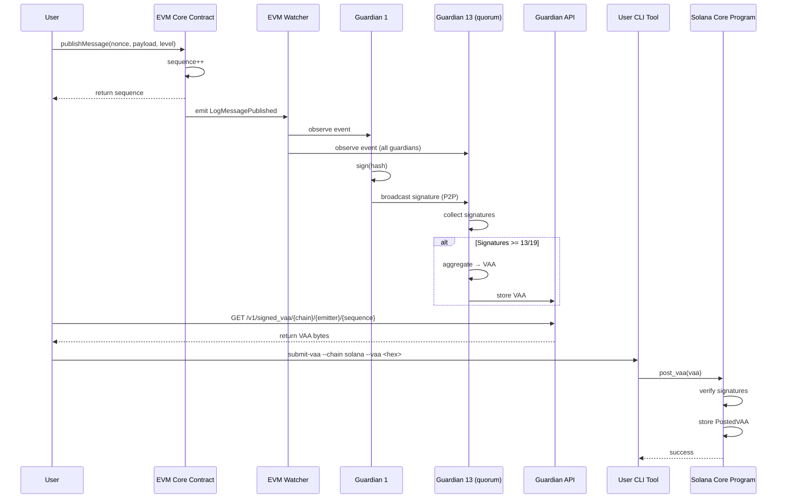
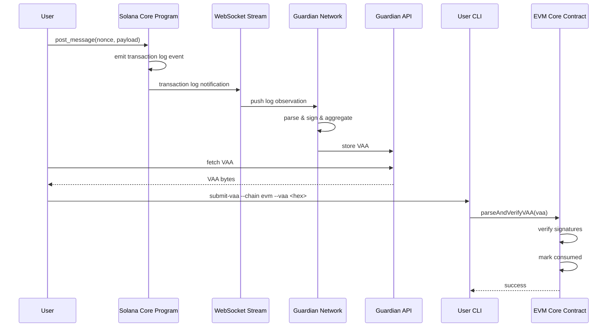

# 多签跨链桥系统设计文档

> 文档版本: v1.0  
> 创建日期: 2025-11-06  
> 基于架构: Wormhole Protocol

---

## 目录

1. [系统概述](#1-系统概述)
2. [核心数据结构](#2-核心数据结构)
3. [智能合约设计](#3-智能合约设计)
4. [Guardian 网络设计](#4-guardian-网络设计)
5. [消息流转流程](#5-消息流转流程)
6. [安全机制](#6-安全机制)
7. [API 接口设计](#7-api-接口设计)

---

## 1. 系统概述

### 1.1 设计原则

| 原则 | 说明 | 实现方式 |
|------|------|---------|
| **去信任化** | 不依赖单一中心化实体 | 19 个独立 Guardian 多签 |
| **模块化** | 组件解耦,易于扩展 | 清晰的接口定义 |
| **确定性** | 相同输入产生相同输出 | 纯函数式设计 |
| **可验证性** | 所有操作可链上验证 | 密码学签名 + 公开数据 |

### 1.2 系统参数

```rust
// 全局常量
pub const GUARDIAN_SET_SIZE: usize = 19;
pub const SIGNATURE_QUORUM: usize = 13;  // 68%+ 共识
pub const VAA_VERSION: u8 = 1;
pub const CONSISTENCY_LEVEL_FINALIZED: u8 = 200;

// 链 ID 定义
pub const CHAIN_ID_EVM: u16 = 1;
pub const CHAIN_ID_SOLANA: u16 = 2;
```

---

## 2. 核心数据结构

### 2.1 VAA (Verifiable Action Approval)

#### 2.1.1 Header

```rust
#[derive(Debug, Clone, Serialize, Deserialize)]
pub struct VAAHeader {
    /// VAA 格式版本 (当前为 1)
    pub version: u8,
    
    /// Guardian Set 索引
    pub guardian_set_index: u32,
    
    /// 签名数量
    pub len_signatures: u8,
}

impl VAAHeader {
    pub const SIZE: usize = 6; // 1 + 4 + 1
}
```

#### 2.1.2 Body

```rust
#[derive(Debug, Clone, Serialize, Deserialize)]
pub struct VAABody {
    /// 消息创建时间戳 (Unix seconds)
    pub timestamp: u32,
    
    /// 随机数 (防重放)
    pub nonce: u32,
    
    /// 源链 ID
    pub emitter_chain: u16,
    
    /// 发送合约地址 (32 字节统一格式)
    pub emitter_address: [u8; 32],
    
    /// 消息序列号 (每个 emitter 递增)
    pub sequence: u64,
    
    /// 一致性等级 (确认深度)
    pub consistency_level: u8,
    
    /// 业务数据
    pub payload: Vec<u8>,
}

impl VAABody {
    /// 计算消息摘要 (用于签名)
    pub fn digest(&self) -> [u8; 32] {
        let serialized = self.serialize();
        
        // EVM 使用双重哈希
        let hash1 = keccak256(&serialized);
        let hash2 = keccak256(&hash1);
        hash2
    }
}
```

#### 2.1.3 Signature

```rust
#[derive(Debug, Clone, Serialize, Deserialize)]
pub struct Signature {
    /// Guardian 在 GuardianSet 中的索引
    pub index: u8,
    
    /// ECDSA 签名 r 值
    pub r: [u8; 32],
    
    /// ECDSA 签名 s 值
    pub s: [u8; 32],
    
    /// 恢复 ID (27 或 28)
    pub v: u8,
}

impl Signature {
    pub const SIZE: usize = 66; // 1 + 32 + 32 + 1
}
```

#### 2.1.4 完整 VAA

```rust
#[derive(Debug, Clone)]
pub struct VAA {
    /// VAA 头部
    pub header: VAAHeader,
    
    /// Guardian 签名列表 (至少 13 个)
    pub signatures: Vec<Signature>,
    
    /// VAA 主体
    pub body: VAABody,
}

impl VAA {
    /// 序列化为字节数组
    pub fn serialize(&self) -> Vec<u8> {
        let mut buf = Vec::new();
        
        // Header
        buf.push(self.header.version);
        buf.extend_from_slice(&self.header.guardian_set_index.to_be_bytes());
        buf.push(self.signatures.len() as u8);
        
        // Signatures
        for sig in &self.signatures {
            buf.push(sig.index);
            buf.extend_from_slice(&sig.r);
            buf.extend_from_slice(&sig.s);
            buf.push(sig.v);
        }
        
        // Body
        buf.extend_from_slice(&self.body.timestamp.to_be_bytes());
        buf.extend_from_slice(&self.body.nonce.to_be_bytes());
        buf.extend_from_slice(&self.body.emitter_chain.to_be_bytes());
        buf.extend_from_slice(&self.body.emitter_address);
        buf.extend_from_slice(&self.body.sequence.to_be_bytes());
        buf.push(self.body.consistency_level);
        buf.extend_from_slice(&self.body.payload);
        
        buf
    }
    
    /// 从字节数组反序列化
    pub fn deserialize(data: &[u8]) -> Result<Self, ParseError> {
        // 实现解析逻辑...
    }
}
```

### 2.2 Guardian Set

```rust
#[derive(Debug, Clone, Serialize, Deserialize)]
pub struct GuardianSet {
    /// Guardian Set 索引
    pub index: u32,
    
    /// Guardian 公钥列表 (Ethereum 地址格式)
    pub keys: Vec<[u8; 20]>,
    
    /// 创建时间
    pub creation_time: i64,
    
    /// 过期时间 (0 表示当前活跃)
    pub expiration_time: u32,
}

impl GuardianSet {
    /// 验证 Guardian 索引是否有效
    pub fn validate_index(&self, index: usize) -> bool {
        index < self.keys.len()
    }
    
    /// 获取 Guardian 地址
    pub fn get_key(&self, index: usize) -> Option<&[u8; 20]> {
        self.keys.get(index)
    }
}
```

### 2.3 消息观察 (Observation)

```rust
#[derive(Debug, Clone)]
pub struct Observation {
    /// 消息摘要
    pub hash: [u8; 32],
    
    /// 源链 ID
    pub emitter_chain: u16,
    
    /// 发送者地址
    pub emitter_address: [u8; 32],
    
    /// 序列号
    pub sequence: u64,
    
    /// 原始消息内容
    pub message: VAABody,
    
    /// 观察时间
    pub observed_at: i64,
}

/// Guardian 的签名观察
#[derive(Debug, Clone)]
pub struct SignedObservation {
    pub observation: Observation,
    pub signature: Signature,
    pub guardian_index: u8,
}
```

---

## 3. 智能合约设计

### 3.1 EVM Core Contract

#### 3.1.1 合约状态

```solidity
// SPDX-License-Identifier: MIT
pragma solidity ^0.8.20;

contract CoreContract {
    /// ===== 状态变量 =====
    
    /// Guardian Set 存储
    struct GuardianSet {
        address[] keys;
        uint32 expirationTime;
    }
    mapping(uint32 => GuardianSet) public guardianSets;
    
    /// 当前 Guardian Set 索引
    uint32 public guardianSetIndex;
    
    /// 已消费的 VAA (防重放)
    mapping(bytes32 => bool) public consumedVAAs;
    
    /// 消息序列号 (每个发送者独立)
    mapping(address => uint64) public sequences;
    
    /// 链 ID
    uint16 public immutable chainId;
    
    /// 协议费用
    uint256 public messageFee;
    
    
    /// ===== 事件 =====
    
    event LogMessagePublished(
        address indexed sender,
        uint64 sequence,
        uint32 nonce,
        bytes payload,
        uint8 consistencyLevel
    );
    
    event GuardianSetAdded(uint32 indexed index);
    
    event VAAParsed(
        bytes32 indexed hash,
        uint16 emitterChain,
        bytes32 emitterAddress,
        uint64 sequence
    );
}
```

#### 3.1.2 核心函数

```solidity
/// 发布消息
function publishMessage(
    uint32 nonce,
    bytes memory payload,
    uint8 consistencyLevel
) external payable returns (uint64 sequence) {
    // 1. 检查费用
    require(msg.value >= messageFee, "Insufficient fee");
    
    // 2. 获取序列号
    sequence = sequences[msg.sender]++;
    
    // 3. 发出事件
    emit LogMessagePublished(
        msg.sender,
        sequence,
        nonce,
        payload,
        consistencyLevel
    );
    
    return sequence;
}

/// 解析并验证 VAA
function parseAndVerifyVAA(
    bytes memory encodedVAA
) public view returns (
    VM memory vm,
    bool valid,
    string memory reason
) {
    // 1. 解析 VAA 结构
    vm = parseVM(encodedVAA);
    
    // 2. 检查是否已消费
    if (consumedVAAs[vm.hash]) {
        return (vm, false, "VAA already consumed");
    }
    
    // 3. 获取 Guardian Set
    GuardianSet storage guardianSet = guardianSets[vm.guardianSetIndex];
    require(guardianSet.keys.length > 0, "Invalid guardian set");
    
    // 4. 验证签名数量
    uint8 requiredSigs = uint8((guardianSet.keys.length * 2) / 3 + 1);
    if (vm.signatures.length < requiredSigs) {
        return (vm, false, "Insufficient signatures");
    }
    
    // 5. 验证每个签名
    bytes32 hash = vm.hash;
    uint8 lastIndex = 0;
    
    for (uint i = 0; i < vm.signatures.length; i++) {
        Signature memory sig = vm.signatures[i];
        
        // 签名索引必须递增
        require(sig.guardianIndex >= lastIndex, "Invalid signature order");
        lastIndex = sig.guardianIndex;
        
        // 恢复签名者地址
        address signer = ecrecover(
            hash,
            sig.v,
            sig.r,
            sig.s
        );
        
        // 验证是否为 Guardian
        require(
            signer == guardianSet.keys[sig.guardianIndex],
            "Invalid signature"
        );
    }
    
    return (vm, true, "");
}

/// 消费 VAA (标记已使用)
function consumeVAA(bytes memory encodedVAA) internal {
    (VM memory vm, bool valid,) = parseAndVerifyVAA(encodedVAA);
    require(valid, "Invalid VAA");
    
    consumedVAAs[vm.hash] = true;
}
```

#### 3.1.3 数据结构

```solidity
struct Signature {
    bytes32 r;
    bytes32 s;
    uint8 v;
    uint8 guardianIndex;
}

struct VM {
    uint8 version;
    uint32 timestamp;
    uint32 nonce;
    uint16 emitterChainId;
    bytes32 emitterAddress;
    uint64 sequence;
    uint8 consistencyLevel;
    bytes payload;
    uint32 guardianSetIndex;
    Signature[] signatures;
    bytes32 hash;
}
```

### 3.2 Solana Core Program

#### 3.2.1 程序账户

```rust
use anchor_lang::prelude::*;

#[account]
#[derive(Default)]
pub struct Bridge {
    /// 当前 Guardian Set 索引
    pub guardian_set_index: u32,
    
    /// 配置
    pub config: BridgeConfig,
}

#[derive(AnchorSerialize, AnchorDeserialize, Clone, Default)]
pub struct BridgeConfig {
    /// 协议费用
    pub fee_lamports: u64,
    
    /// 链 ID
    pub chain_id: u16,
}

#[account]
pub struct GuardianSet {
    /// 索引
    pub index: u32,
    
    /// Guardian 公钥列表 (Ethereum 地址格式)
    pub keys: Vec<[u8; 20]>,
    
    /// 创建时间
    pub creation_time: i64,
    
    /// 过期时间
    pub expiration_time: u32,
}

#[account]
pub struct PostedMessage {
    /// 一致性等级
    pub consistency_level: u8,
    
    /// 发送链 ID
    pub emitter_chain: u16,
    
    /// 发送者地址
    pub emitter_address: [u8; 32],
    
    /// 序列号
    pub sequence: u64,
    
    /// 时间戳
    pub timestamp: u32,
    
    /// 随机数
    pub nonce: u32,
    
    /// 业务数据
    pub payload: Vec<u8>,
}

#[account]
pub struct PostedVAA {
    /// VAA 哈希
    pub vaa_hash: [u8; 32],
    
    /// Guardian Set 索引
    pub guardian_set_index: u32,
    
    /// 完整 VAA 数据
    pub vaa: Vec<u8>,
    
    /// 发布时间
    pub posted_at: i64,
}
```

#### 3.2.2 指令实现

```rust
#[program]
pub mod solana_core {
    use super::*;
    
    /// 初始化 Bridge
    pub fn initialize(
        ctx: Context<Initialize>,
        guardian_set_index: u32,
        initial_guardians: Vec<[u8; 20]>,
    ) -> Result<()> {
        let bridge = &mut ctx.accounts.bridge;
        bridge.guardian_set_index = guardian_set_index;
        bridge.config = BridgeConfig {
            fee_lamports: 1_000_000, // 0.001 SOL
            chain_id: 2, // Solana
        };
        
        let guardian_set = &mut ctx.accounts.guardian_set;
        guardian_set.index = guardian_set_index;
        guardian_set.keys = initial_guardians;
        guardian_set.creation_time = Clock::get()?.unix_timestamp;
        guardian_set.expiration_time = 0; // 活跃状态
        
        Ok(())
    }
    
    /// 发布消息
    pub fn post_message(
        ctx: Context<PostMessage>,
        nonce: u32,
        payload: Vec<u8>,
        consistency_level: u8,
    ) -> Result<()> {
        let bridge = &ctx.accounts.bridge;
        let message = &mut ctx.accounts.message;
        let emitter = &ctx.accounts.emitter;
        let sequence_account = &mut ctx.accounts.sequence;
        
        // 更新序列号
        let sequence = sequence_account.value;
        sequence_account.value += 1;
        
        // 填充消息
        message.consistency_level = consistency_level;
        message.emitter_chain = bridge.config.chain_id;
        message.emitter_address = emitter.key().to_bytes();
        message.sequence = sequence;
        message.timestamp = Clock::get()?.unix_timestamp as u32;
        message.nonce = nonce;
        message.payload = payload;
        
        // 发出事件 (Anchor 自动处理)
        emit!(MessagePublished {
            emitter: *emitter.key,
            sequence,
            nonce,
        });
        
        Ok(())
    }
    
    /// 验证签名
    pub fn verify_signatures(
        ctx: Context<VerifySignatures>,
        hash: [u8; 32],
        signatures: Vec<SignatureData>,
    ) -> Result<()> {
        let guardian_set = &ctx.accounts.guardian_set;
        
        // 检查签名数量
        let required = (guardian_set.keys.len() * 2 / 3) + 1;
        require!(
            signatures.len() >= required,
            ErrorCode::InsufficientSignatures
        );
        
        // 验证每个签名
        for sig_data in signatures.iter() {
            let guardian_key = guardian_set.keys
                .get(sig_data.guardian_index as usize)
                .ok_or(ErrorCode::InvalidGuardianIndex)?;
            
            // 使用 secp256k1 指令验证
            verify_secp256k1_signature(
                &hash,
                &sig_data.signature,
                guardian_key,
            )?;
        }
        
        Ok(())
    }
    
    /// 发布 VAA
    pub fn post_vaa(
        ctx: Context<PostVAA>,
        vaa: Vec<u8>,
    ) -> Result<()> {
        // 1. 解析 VAA
        let parsed_vaa = parse_vaa(&vaa)?;
        
        // 2. 验证签名 (调用 verify_signatures)
        // ...
        
        // 3. 存储 VAA
        let posted_vaa = &mut ctx.accounts.posted_vaa;
        posted_vaa.vaa_hash = parsed_vaa.hash;
        posted_vaa.guardian_set_index = parsed_vaa.guardian_set_index;
        posted_vaa.vaa = vaa;
        posted_vaa.posted_at = Clock::get()?.unix_timestamp;
        
        Ok(())
    }
}
```

#### 3.2.3 账户验证

```rust
#[derive(Accounts)]
pub struct PostMessage<'info> {
    #[account(mut)]
    pub bridge: Account<'info, Bridge>,
    
    #[account(
        init,
        payer = payer,
        space = 8 + 1024, // 足够存储消息
        seeds = [
            b"message",
            emitter.key().as_ref(),
            &sequence.value.to_le_bytes()
        ],
        bump
    )]
    pub message: Account<'info, PostedMessage>,
    
    pub emitter: Signer<'info>,
    
    #[account(
        mut,
        seeds = [b"sequence", emitter.key().as_ref()],
        bump
    )]
    pub sequence: Account<'info, Sequence>,
    
    #[account(mut)]
    pub payer: Signer<'info>,
    
    pub system_program: Program<'info, System>,
}

#[derive(Accounts)]
pub struct PostVAA<'info> {
    #[account(
        seeds = [b"guardian_set", &guardian_set.index.to_le_bytes()],
        bump
    )]
    pub guardian_set: Account<'info, GuardianSet>,
    
    #[account(
        init,
        payer = payer,
        space = 8 + 32 + 4 + 4 + vaa.len(),
        seeds = [b"posted_vaa", &vaa_hash],
        bump
    )]
    pub posted_vaa: Account<'info, PostedVAA>,
    
    #[account(mut)]
    pub payer: Signer<'info>,
    
    pub system_program: Program<'info, System>,
}
```

---

## 4. Guardian 网络设计

### 4.1 架构组件

```rust
pub struct GuardianNode {
    /// 节点配置
    config: GuardianConfig,
    
    /// 签名密钥
    keypair: GuardianKeypair,
    
    /// P2P 网络管理器
    network: P2PNetwork,
    
    /// 链观察者
    watchers: Watchers,
    
    /// 观察缓存
    observation_cache: Arc<RwLock<ObservationCache>>,
    
    /// VAA 聚合器
    aggregator: VAAggregator,
    
    /// HTTP API 服务
    api_server: ApiServer,
}

pub struct Watchers {
    evm: EvmWatcher,
    solana: SolanaWatcher,
}
```

### 4.2 P2P 网络层

#### 4.2.1 libp2p 配置

```rust
use libp2p::{
    gossipsub::{self, MessageId, TopicHash},
    identity::Keypair,
    swarm::{NetworkBehaviour, SwarmBuilder},
    PeerId, Swarm,
};

#[derive(NetworkBehaviour)]
pub struct BridgeBehaviour {
    gossipsub: gossipsub::Behaviour,
    identify: identify::Behaviour,
}

pub struct P2PNetwork {
    swarm: Swarm<BridgeBehaviour>,
    observation_topic: TopicHash,
    signature_topic: TopicHash,
}

impl P2PNetwork {
    pub async fn new(config: &P2PConfig) -> Result<Self> {
        // 1. 生成节点身份
        let local_key = Keypair::generate_ed25519();
        let peer_id = PeerId::from(local_key.public());
        
        // 2. 配置 Gossipsub
        let gossipsub_config = gossipsub::ConfigBuilder::default()
            .heartbeat_interval(Duration::from_secs(1))
            .validation_mode(gossipsub::ValidationMode::Strict)
            .build()
            .unwrap();
        
        let mut gossipsub = gossipsub::Behaviour::new(
            MessageAuthenticity::Signed(local_key.clone()),
            gossipsub_config,
        )?;
        
        // 3. 订阅主题
        let observation_topic = gossipsub::IdentTopic::new("bridge/observations");
        let signature_topic = gossipsub::IdentTopic::new("bridge/signatures");
        
        gossipsub.subscribe(&observation_topic)?;
        gossipsub.subscribe(&signature_topic)?;
        
        // 4. 构建 Swarm
        let behaviour = BridgeBehaviour {
            gossipsub,
            identify: identify::Behaviour::new(identify::Config::new(
                "/bridge/1.0.0".to_string(),
                local_key.public(),
            )),
        };
        
        let swarm = SwarmBuilder::with_existing_identity(local_key)
            .with_tokio()
            .with_tcp(
                tcp::Config::default(),
                noise::Config::new,
                yamux::Config::default,
            )?
            .with_behaviour(|_| behaviour)?
            .build();
        
        Ok(Self {
            swarm,
            observation_topic: observation_topic.hash(),
            signature_topic: signature_topic.hash(),
        })
    }
    
    /// 广播观察
    pub async fn broadcast_observation(
        &mut self,
        observation: &SignedObservation,
    ) -> Result<()> {
        let data = bincode::serialize(observation)?;
        self.swarm
            .behaviour_mut()
            .gossipsub
            .publish(self.observation_topic.clone(), data)?;
        Ok(())
    }
    
    /// 接收消息
    pub async fn receive(&mut self) -> Option<NetworkEvent> {
        // 处理 Swarm 事件...
    }
}
```

#### 4.2.2 消息格式

```rust
#[derive(Serialize, Deserialize)]
pub enum P2PMessage {
    /// 新观察
    Observation {
        hash: [u8; 32],
        emitter_chain: u16,
        emitter_address: [u8; 32],
        sequence: u64,
        message: VAABody,
    },
    
    /// 签名
    Signature {
        hash: [u8; 32],
        guardian_index: u8,
        signature: Signature,
    },
    
    /// VAA 就绪通知
    VAAReady {
        hash: [u8; 32],
        vaa: VAA,
    },
}
```

### 4.3 观察与签名流程

```rust
impl GuardianNode {
    /// 主运行循环
    pub async fn run(&mut self) -> Result<()> {
        loop {
            tokio::select! {
                // 1. 处理链上事件
                Some(event) = self.watchers.next_event() => {
                    self.handle_chain_event(event).await?;
                }
                
                // 2. 处理 P2P 消息
                Some(msg) = self.network.receive() => {
                    self.handle_p2p_message(msg).await?;
                }
                
                // 3. 检查超时
                _ = tokio::time::sleep(Duration::from_secs(5)) => {
                    self.check_timeouts().await?;
                }
            }
        }
    }
    
    /// 处理链上事件
    async fn handle_chain_event(&mut self, event: ChainEvent) -> Result<()> {
        // 1. 创建观察
        let observation = Observation::from_event(&event);
        
        // 2. 对观察签名
        let signature = self.keypair.sign(&observation.hash);
        
        let signed_obs = SignedObservation {
            observation: observation.clone(),
            signature,
            guardian_index: self.config.index as u8,
        };
        
        // 3. 广播签名观察
        self.network.broadcast_observation(&signed_obs).await?;
        
        // 4. 缓存自己的签名
        self.observation_cache
            .write()
            .await
            .add_signature(observation.hash, signed_obs);
        
        Ok(())
    }
    
    /// 处理 P2P 消息
    async fn handle_p2p_message(&mut self, msg: P2PMessage) -> Result<()> {
        match msg {
            P2PMessage::Observation { hash, message, .. } => {
                // 收到其他 Guardian 的观察,缓存起来
                self.observation_cache
                    .write()
                    .await
                    .add_observation(hash, message);
            }
            
            P2PMessage::Signature { hash, guardian_index, signature } => {
                // 收到签名
                let mut cache = self.observation_cache.write().await;
                cache.add_signature(hash, SignedObservation {
                    observation: cache.get_observation(&hash)?.clone(),
                    signature,
                    guardian_index,
                });
                
                // 检查是否达到 quorum
                if cache.signature_count(&hash) >= SIGNATURE_QUORUM {
                    let vaa = self.aggregator.create_vaa(&hash, &cache)?;
                    
                    // 存储 VAA
                    self.api_server.store_vaa(vaa.clone()).await?;
                    
                    // 广播 VAA 就绪
                    self.network.broadcast(P2PMessage::VAAReady {
                        hash,
                        vaa,
                    }).await?;
                }
            }
            
            P2PMessage::VAAReady { vaa, .. } => {
                // 存储其他节点生成的 VAA
                self.api_server.store_vaa(vaa).await?;
            }
        }
        
        Ok(())
    }
}
```

---

## 5. 消息流转流程

### 5.1 EVM → Solana



### 5.2 Solana → EVM



---

## 6. 安全机制

### 6.1 防重放攻击

```rust
// EVM
mapping(bytes32 => bool) public consumedVAAs;

function consumeVAA(bytes memory vaa) internal {
    bytes32 hash = keccak256(vaa);
    require(!consumedVAAs[hash], "VAA already consumed");
    consumedVAAs[hash] = true;
}
```

```rust
// Solana
#[account]
pub struct ConsumedVAA {
    pub vaa_hash: [u8; 32],
    pub consumed_at: i64,
}
```

### 6.2 签名验证

```rust
pub fn verify_guardian_signature(
    hash: &[u8; 32],
    signature: &Signature,
    guardian_set: &GuardianSet,
) -> Result<bool> {
    // 1. 检查 guardian 索引
    let guardian_key = guardian_set
        .get_key(signature.index as usize)
        .ok_or(Error::InvalidGuardianIndex)?;
    
    // 2. 恢复公钥
    let recovered = recover_pubkey(hash, signature)?;
    
    // 3. 计算地址
    let recovered_addr = pubkey_to_eth_address(&recovered);
    
    // 4. 比对
    Ok(recovered_addr == *guardian_key)
}
```

### 6.3 时间锁与过期

```rust
impl GuardianSet {
    pub fn is_active(&self, current_time: i64) -> bool {
        self.expiration_time == 0 || 
        (self.expiration_time as i64) > current_time
    }
}
```

---

## 7. API 接口设计

### 7.1 Guardian REST API

#### Endpoint: `GET /v1/signed_vaa/{chain_id}/{emitter}/{sequence}`

**请求**:
```http
GET /v1/signed_vaa/1/0x1234.../42 HTTP/1.1
Host: guardian-1.bridge.local:7071
```

**响应**:
```json
{
  "vaaBytes": "0x01000000...",
  "vaa": {
    "version": 1,
    "guardianSetIndex": 0,
    "signatures": [...],
    "timestamp": 1699276800,
    "nonce": 0,
    "emitterChain": 1,
    "emitterAddress": "0x1234...",
    "sequence": 42,
    "consistencyLevel": 200,
    "payload": "0xabcd..."
  }
}
```

#### Endpoint: `GET /v1/health`

```json
{
  "status": "healthy",
  "guardianIndex": 1,
  "p2pPeers": 18,
  "watcherStatus": {
    "evm": "connected",
    "solana": "connected"
  }
}
```

### 7.2 CLI 工具接口

```bash
# 获取 VAA
bridge-cli fetch-vaa \
  --guardian-url http://localhost:7071 \
  --chain 1 \
  --emitter 0x1234... \
  --sequence 42 \
  --output vaa.bin

# 提交 VAA 到目标链
bridge-cli submit-vaa \
  --chain solana \
  --rpc-url http://localhost:8899 \
  --vaa-file vaa.bin \
  --payer ~/.config/solana/id.json
```

---

**文档状态**: ✅ 待审阅  
**相关文档**: 
- [03-technical-research.md](./03-technical-research.md)
- [01-bridge-design.md](./01-bridge-design.md)

---

**下一步**: 审阅通过后开始合约开发
