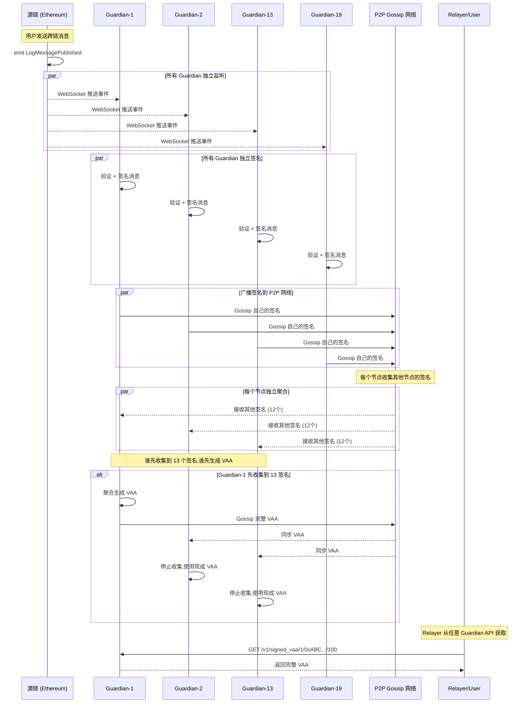

# Guardian 共识机制与 Relayer 工作原理

> 解答: Guardian 如何达成共识？Relayer 如何获取 VAA？

---

## 1. Guardian 网络共识流程

### 1.1 核心机制概述

**关键点**: Guardian 网络 **不是传统的共识算法** (如 Raft/PBFT)，而是 **观察-签名-聚合** 模式

```
传统共识 (如 Raft)          Guardian 模式 (Wormhole)
─────────────────          ────────────────────────
Leader 提议                所有节点独立观察
Follower 投票              所有节点独立签名
达成一致后提交             任意节点聚合签名 (无 Leader)
```

### 1.2 完整共识流程



---

## 2. 详细问题解答

### Q1: Guardian 如何达成共识？

**答**: 通过 **乐观并行** + **P2P Gossip** + **先到先得**

#### 阶段 1: 独立观察 (无需共识)

```rust
// 每个 Guardian 独立运行
async fn watch_ethereum_events(&self) {
    let filter = Filter::new()
        .address(CORE_CONTRACT_ADDRESS)
        .event("LogMessagePublished(address,uint64,uint32,bytes,uint8)");
    
    let mut stream = self.eth_client.subscribe_logs(&filter).await?;
    
    while let Some(log) = stream.next().await {
        // 每个节点独立解析
        let observation = self.parse_log(log)?;
        
        // 独立验证 (无需等待其他节点)
        if self.validate_observation(&observation).await? {
            self.process_observation(observation).await?;
        }
    }
}
```

#### 阶段 2: 独立签名 (无需共识)

```rust
async fn process_observation(&self, obs: Observation) -> Result<()> {
    // 1. 构造 VAA Body
    let vaa_body = VAABody {
        timestamp: obs.timestamp,
        nonce: obs.nonce,
        emitter_chain: obs.chain_id,
        emitter_address: obs.emitter,
        sequence: obs.sequence,
        consistency_level: obs.consistency_level,
        payload: obs.payload,
    };
    
    // 2. 计算摘要
    let digest = vaa_body.digest();
    
    // 3. 用自己的私钥签名 (不需要其他节点参与)
    let signature = self.sign_digest(&digest)?;
    
    // 4. 立即广播到 P2P 网络
    self.gossip_signature(obs.message_id(), signature).await?;
    
    // 5. 开始收集其他签名
    self.start_collecting(obs.message_id(), vaa_body).await?;
    
    Ok(())
}
```

#### 阶段 3: P2P Gossip 签名

```rust
// 每个节点维护一个签名池
struct SignatureCollector {
    // key: MessageID, value: 收集到的签名列表
    signatures: HashMap<MessageID, Vec<(GuardianIndex, Signature)>>,
}

async fn handle_gossip_message(&mut self, msg: GossipMessage) {
    match msg {
        GossipMessage::Signature { message_id, guardian_index, signature } => {
            // 验证签名
            if self.verify_signature(&message_id, guardian_index, &signature) {
                // 添加到签名池
                self.signatures
                    .entry(message_id)
                    .or_default()
                    .push((guardian_index, signature));
                
                // 检查是否达到法定人数
                if self.signatures[&message_id].len() >= QUORUM {
                    self.aggregate_vaa(message_id).await?;
                }
            }
        }
        
        GossipMessage::VAA { vaa } => {
            // 收到完整 VAA,停止收集
            self.handle_complete_vaa(vaa).await?;
        }
    }
}
```

---

### Q2: 只需要一次投票吗？

**答**: 不是投票,是 **一次签名** + **持续收集**

**误区**: 把 Guardian 当成投票系统
```
❌ 错误理解:
Guardian-1: "我投赞成票"
Guardian-2: "我投反对票"
→ 统计票数 → 多数胜出
```

**正确理解**: 每个 Guardian 是见证人
```
✅ 正确:
Guardian-1: "我看到了消息 X,这是我的签名" (签名 = 见证)
Guardian-2: "我也看到了消息 X,这是我的签名"
...
Guardian-13: "我也看到了消息 X,这是我的签名"
→ 13 个独立见证 → VAA 成立
```

**时间线**:
```
T=0s:  事件发生在源链
T=0.1s: Guardian-1 观察到 → 立即签名 → Gossip
T=0.1s: Guardian-2 观察到 → 立即签名 → Gossip
T=0.1s: Guardian-3 观察到 → 立即签名 → Gossip
...
T=0.2s: Guardian-1 收集到 13 个签名 → 生成 VAA → Gossip VAA
T=0.3s: Guardian-2 收集到 12 个签名 → 收到 Guardian-1 的 VAA → 停止收集
```

---

### Q3: 只需要一个节点收集到足够签名就可以广播 VAA 吗？

**答**: ✅ **是的！** 这是 Wormhole 的关键设计

#### 先到先得机制

```rust
async fn aggregate_vaa(&mut self, message_id: MessageID) -> Result<()> {
    let signatures = &self.signatures[&message_id];
    
    // 检查法定人数
    if signatures.len() < QUORUM {
        return Ok(()); // 还不够,继续等待
    }
    
    // 已经有完整 VAA 了?
    if self.completed_vaas.contains_key(&message_id) {
        return Ok(()); // 别人已经生成了,不用重复
    }
    
    // 🎯 关键: 我是第一个收集到 13 签名的!
    let vaa = VAA {
        header: VAAHeader {
            version: 1,
            guardian_set_index: self.current_guardian_set_index,
            len_signatures: signatures.len() as u8,
        },
        signatures: signatures.clone(),
        body: self.vaa_bodies[&message_id].clone(),
    };
    
    // 1. 保存到本地数据库
    self.db.store_vaa(&vaa).await?;
    
    // 2. 广播到 P2P 网络 (让其他节点知道)
    self.gossip_complete_vaa(vaa.clone()).await?;
    
    // 3. 暴露给 API (Relayer 可以获取)
    self.completed_vaas.insert(message_id, vaa);
    
    info!("🎉 Successfully aggregated VAA for {}", message_id);
    Ok(())
}
```

#### 为什么这样设计？

**优势**:
1. ⚡ **速度快**: 不需要等所有 19 个节点都签名
2. 🔄 **容错高**: 即使 6 个节点离线,剩余 13 个就能工作
3. 🚫 **无单点**: 任何节点都可以是第一个聚合者
4. 📡 **最终一致**: 所有节点最终都会有相同的 VAA

**劣势**:
- ⚠️ 可能产生多个 VAA 副本 (但内容相同,无安全问题)

---

### Q4: 其他节点收到 VAA 后怎么办？

**答**: **验证 → 保存 → 停止收集**

```rust
async fn handle_complete_vaa(&mut self, vaa: VAA) -> Result<()> {
    let message_id = vaa.message_id();
    
    // 1. 验证 VAA (防止恶意节点)
    if !self.verify_vaa(&vaa)? {
        warn!("❌ Received invalid VAA from gossip");
        return Ok(());
    }
    
    // 2. 检查是否已经有了
    if self.completed_vaas.contains_key(&message_id) {
        return Ok(()); // 已经有了,忽略
    }
    
    // 3. 检查本地签名池状态
    match self.signatures.get(&message_id) {
        Some(local_sigs) if local_sigs.len() >= QUORUM => {
            // 情况 A: 我也收集到 13 个了,但别人先发布
            // → 比较签名集合
            if vaa.signatures.len() >= local_sigs.len() {
                // 别人的签名更多,用别人的
                info!("Using gossiped VAA (more signatures)");
                self.completed_vaas.insert(message_id, vaa.clone());
            } else {
                // 我的签名更多,生成自己的 VAA
                self.aggregate_vaa(message_id).await?;
                return Ok(());
            }
        }
        
        Some(_) => {
            // 情况 B: 我还没收集够,直接用现成的
            info!("✅ Received complete VAA via gossip, stopping collection");
            self.completed_vaas.insert(message_id, vaa.clone());
            // 停止收集签名 (不需要继续等待)
            self.signatures.remove(&message_id);
        }
        
        None => {
            // 情况 C: 我还没开始收集 (可能还没观察到事件)
            info!("Received VAA before observation, storing for later");
            self.completed_vaas.insert(message_id, vaa.clone());
        }
    }
    
    // 4. 保存到数据库
    self.db.store_vaa(&vaa).await?;
    
    // 5. 暴露给 API
    info!("VAA now available via API: {}", message_id);
    
    Ok(())
}
```

#### 三种情况可视化

```
情况 A: 两个节点几乎同时完成
─────────────────────────────────
Guardian-1: 收集 13 签名 → 生成 VAA-A → Gossip
Guardian-2: 收集 13 签名 → 生成 VAA-B → 收到 VAA-A
                       → 比较 → 使用签名更多的

情况 B: 一个节点明显更快
─────────────────────────────────
Guardian-1: 收集 13 签名 → 生成 VAA → Gossip
Guardian-2: 收集  8 签名 → 收到 VAA → 停止收集 → 使用现成 VAA

情况 C: 网络延迟导致顺序颠倒
─────────────────────────────────
Guardian-1: 观察事件 → 签名 → 收集 → 生成 VAA → Gossip
Guardian-2: 还没观察到 → 先收到 VAA → 缓存
          → 后来观察到事件 → 发现已有 VAA → 直接使用
```

---

### Q5: 还需要继续接收签名吗？

**答**: ❌ **不需要**,收到完整 VAA 就停止收集

```rust
// 签名收集有终止条件
async fn collect_signatures(&mut self, message_id: MessageID) {
    let mut timeout = tokio::time::interval(Duration::from_secs(30));
    
    loop {
        tokio::select! {
            // 收到新签名
            Some(sig) = self.signature_rx.recv() => {
                self.add_signature(message_id, sig);
                
                // ✅ 条件 1: 收集到足够签名
                if self.signatures[&message_id].len() >= QUORUM {
                    self.aggregate_vaa(message_id).await?;
                    break; // 停止收集
                }
            }
            
            // 收到完整 VAA
            Some(vaa) = self.vaa_rx.recv() => {
                if vaa.message_id() == message_id {
                    // ✅ 条件 2: 收到现成 VAA
                    self.handle_complete_vaa(vaa).await?;
                    break; // 停止收集
                }
            }
            
            // 超时
            _ = timeout.tick() => {
                // ✅ 条件 3: 超时未达到法定人数
                warn!("⏰ Timeout collecting signatures for {}", message_id);
                break; // 停止收集 (可能链重组了)
            }
        }
    }
}
```

---

## 3. Relayer 工作原理

### 3.1 Relayer 如何获取 Guardian 状态？

**答**: 通过 **Guardian REST API** 轮询

**🎯 关键点**: Relayer **只需要从任意一个 Guardian 获取 VAA 即可**！

**为什么?**
- ✅ VAA 已经包含 13/19 签名,任何人都可以验证
- ✅ 所有 Guardian 最终都会同步相同的 VAA
- ✅ 从任意节点获取的 VAA 都是有效的
- ✅ 多个 Guardian URL 只是为了**容错**,不是为了聚合

```rust
// Relayer 代码示例
pub struct Relayer {
    guardian_api_urls: Vec<String>, // 多个 Guardian API 地址 (容错用)
    http_client: reqwest::Client,
}

impl Relayer {
    // 方法 1: 主动轮询 (适合用户手动中继)
    pub async fn fetch_vaa(
        &self,
        chain_id: u16,
        emitter: &str,
        sequence: u64,
    ) -> Result<VAA> {
        let path = format!(
            "/v1/signed_vaa/{}/{}/{}",
            chain_id, emitter, sequence
        );
        
        // 🎯 遍历 Guardian 列表,任意一个返回成功就够了!
        for guardian_url in &self.guardian_api_urls {
            let url = format!("{}{}", guardian_url, path);
            
            match self.http_client.get(&url).send().await {
                Ok(resp) if resp.status().is_success() => {
                    let vaa_bytes = resp.bytes().await?;
                    let vaa = VAA::deserialize(&vaa_bytes)?;
                    
                    // ✅ 成功! 直接返回,不需要继续查询其他 Guardian
                    info!("✅ Got VAA from {}", guardian_url);
                    return Ok(vaa);
                }
                Ok(resp) if resp.status() == 404 => {
                    // VAA 还未就绪,尝试下一个 Guardian
                    // (可能这个节点网络慢,还没聚合完成)
                    continue;
                }
                Err(e) => {
                    // 这个 Guardian 网络故障,尝试下一个
                    warn!("Failed to query {}: {}", guardian_url, e);
                    continue;
                }
            }
        }
        
        // 所有 Guardian 都没准备好或都失败了
        Err(anyhow!("VAA not ready yet on any Guardian"))
    }
    
    // 方法 2: 监听 Guardian Gossip 网络 (高级)
    pub async fn subscribe_vaa_stream(&self) -> Result<impl Stream<Item = VAA>> {
        // 连接到 Guardian P2P 网络
        let mut gossip_client = GossipClient::connect(&self.guardian_p2p_addr).await?;
        
        // 订阅 VAA 消息
        let stream = gossip_client.subscribe_topic("vaa-broadcast").await?;
        
        Ok(stream.filter_map(|msg| {
            if let GossipMessage::VAA { vaa } = msg {
                Some(vaa)
            } else {
                None
            }
        }))
    }
}
```

### 3.2 Guardian API 端点

```rust
// Guardian 暴露的 REST API
#[derive(Router)]
pub struct GuardianAPI {
    vaa_store: Arc<VAAStore>,
}

impl GuardianAPI {
    // GET /v1/signed_vaa/:chain/:emitter/:sequence
    async fn get_signed_vaa(
        Path((chain_id, emitter, sequence)): Path<(u16, String, u64)>,
    ) -> Result<Response> {
        let message_id = MessageID {
            emitter_chain: chain_id,
            emitter_address: hex::decode(&emitter)?,
            sequence,
        };
        
        match self.vaa_store.get(&message_id).await? {
            Some(vaa) => {
                // ✅ VAA 已就绪
                Ok(Response::new(vaa.serialize()))
            }
            None => {
                // ⏳ VAA 还未达成共识
                Ok(Response::builder()
                    .status(StatusCode::NOT_FOUND)
                    .body("VAA not available yet".into())?)
            }
        }
    }
    
    // GET /v1/health
    async fn health() -> Json<HealthStatus> {
        Json(HealthStatus {
            current_guardian_set: self.current_guardian_set_index,
            observed_chains: self.active_chains(),
            p2p_peers: self.p2p_peer_count(),
        })
    }
}
```

---

### 3.3 Relayer 如何知道 VAA 何时就绪？

**答**: 三种方式

#### 方式 1: 轮询 Guardian API (最常用)

```rust
async fn wait_for_vaa(
    &self,
    chain_id: u16,
    emitter: &str,
    sequence: u64,
) -> Result<VAA> {
    let mut attempts = 0;
    let max_attempts = 60; // 最多等 5 分钟
    
    loop {
        match self.fetch_vaa(chain_id, emitter, sequence).await {
            Ok(vaa) => {
                info!("✅ VAA ready after {} attempts", attempts);
                return Ok(vaa);
            }
            Err(_) if attempts < max_attempts => {
                attempts += 1;
                tokio::time::sleep(Duration::from_secs(5)).await;
            }
            Err(e) => {
                return Err(anyhow!("VAA not ready after 5 minutes: {}", e));
            }
        }
    }
}
```

#### 方式 2: 监听源链事件 + 延迟查询

```rust
async fn auto_relay_messages(&self) -> Result<()> {
    // 1. 监听源链事件
    let filter = Filter::new()
        .address(SOURCE_CORE_CONTRACT)
        .event("LogMessagePublished(...)");
    
    let mut stream = self.eth_client.subscribe_logs(&filter).await?;
    
    while let Some(log) = stream.next().await {
        let sequence = parse_sequence(&log)?;
        
        // 2. 等待 Guardian 达成共识 (经验值: ~5秒)
        tokio::time::sleep(Duration::from_secs(5)).await;
        
        // 3. 获取 VAA
        let vaa = self.wait_for_vaa(CHAIN_ID, EMITTER, sequence).await?;
        
        // 4. 提交到目标链
        self.submit_to_target_chain(vaa).await?;
    }
    
    Ok(())
}
```

#### 方式 3: Wormhole Spy 服务 (进阶)

```rust
// 使用 Wormhole Spy 组件 (监听 Guardian Gossip 网络)
async fn subscribe_spy(&self) -> Result<()> {
    let mut spy_client = SpyClient::connect("http://guardian-spy:7073").await?;
    
    // 订阅所有 VAA
    let mut stream = spy_client.subscribe_signed_vaa(
        SubscribeSignedVAARequest {
            filters: vec![], // 空 = 所有 VAA
        }
    ).await?;
    
    while let Some(vaa_msg) = stream.message().await? {
        let vaa = VAA::deserialize(&vaa_msg.vaa_bytes)?;
        
        info!("🎯 Received VAA via Spy: {:?}", vaa.message_id());
        
        // 立即中继 (无需轮询)
        self.submit_to_target_chain(vaa).await?;
    }
    
    Ok(())
}
```

---

## 4. 时序图: 端到端流程

```
时间轴              源链        Guardian-1  Guardian-2  ...  Guardian-13  Relayer    目标链
──────────────────────────────────────────────────────────────────────────────────────
T=0s     用户发送   ●
                   │ emit LogMessagePublished
                   ├─────────►●
                   ├─────────────────────►●
                   └──────────────────────────────────►●
                   
T=0.1s   观察+签名             ● sign            ● sign        ● sign
                               ├─Gossip─┐        │             │
                               │         ├───────┤             │
                               │         │       └─────────────┤
                               
T=0.2s   收集签名              ● (收到12个)      ● (收到10个)  ● (收到11个)
                               │                 │             │
                               ├─Gossip─┐        │             │
                               │         ├───────┤             │
                               │         │       └─────────────┤
                               
T=0.3s   聚合VAA               ● 达到13,生成VAA
                               │ Gossip VAA
                               ├─────────┼────►● 收到VAA,停止
                               │         │     │
                               │         └──────────────────►● 收到VAA,停止
                               
T=0.4s   API就绪               ● VAA存储完成
                                         
T=1s     Relayer查询                                                    ●
                                                                         │ GET /v1/signed_vaa/...
                                                                         ├──►●
                                                                         │   │
T=1.1s   获取VAA                                                        ●◄──┤ 200 OK + VAA bytes
                                                                         │
T=1.2s   提交目标链                                                     ●───────────►●
                                                                                       │ verify VAA
                                                                                       │ execute
                                                                                       ● ✅ 完成
```

---

## 5. 常见误区澄清

### 误区 1: Guardian 需要投票达成共识

❌ **错误**: "Guardian 投票决定消息是否有效"

✅ **正确**: Guardian 是见证人,不是裁判
- 消息有效性由源链决定 (事件已发出 = 有效)
- Guardian 只是见证并签名,不做主观判断
- 13/19 是防止单点故障,不是多数投票

### 误区 2: 需要等所有 Guardian 签名

❌ **错误**: "必须等 19 个 Guardian 都签名才能生成 VAA"

✅ **正确**: 13 个就够了
- 达到法定人数 (13) 即可聚合
- 剩余 6 个可能网络慢/离线/正在重启
- VAA 一旦生成,其他签名就不重要了

### 误区 3: 每个 Guardian 都会生成 VAA

❌ **错误**: "19 个节点会产生 19 个不同的 VAA"

✅ **正确**: 通常只有 1-2 个节点生成 VAA
- 第一个收集够的节点生成 VAA 并广播
- 其他节点收到后停止收集,直接使用
- 极端情况下可能有多个,但内容相同 (签名可能不同)

### 误区 4: Relayer 需要等很久

❌ **错误**: "Relayer 需要等待几分钟才能获取 VAA"

✅ **正确**: 通常 1-5 秒
- Guardian 观察: ~0.1s (WebSocket 实时)
- 签名+Gossip: ~0.2s (本地签名+网络传播)
- 聚合: ~0.1s (13 签名收集完成)
- **总计**: ~0.5-2 秒 (网络良好时)
- 加上安全余量,Relayer 等 5 秒即可查询

---

## 6. 性能优化建议

### 6.1 Guardian 优化

```rust
// 1. 并行验证签名
async fn verify_vaa(&self, vaa: &VAA) -> Result<bool> {
    let digest = vaa.body.digest();
    
    // 并行验证所有签名
    let verify_tasks: Vec<_> = vaa.signatures.iter()
        .map(|sig| {
            let digest = digest.clone();
            let guardian_set = self.guardian_set.clone();
            tokio::spawn(async move {
                verify_signature(&digest, sig, &guardian_set)
            })
        })
        .collect();
    
    let results = futures::future::join_all(verify_tasks).await;
    Ok(results.iter().filter(|r| r.is_ok()).count() >= QUORUM)
}

// 2. 签名去重
fn add_signature(&mut self, msg_id: MessageID, sig: Signature) {
    self.signatures
        .entry(msg_id)
        .or_default()
        .entry(sig.guardian_index) // 用 HashMap 自动去重
        .or_insert(sig);
}

// 3. 内存清理
async fn cleanup_old_observations(&mut self) {
    let cutoff = SystemTime::now() - Duration::from_hours(24);
    
    self.signatures.retain(|id, _| {
        id.timestamp > cutoff
    });
}
```

### 6.2 Relayer 优化

```rust
// 1. 并行查询多个 Guardian (谁先返回用谁的)
async fn fetch_vaa_fast(&self, msg_id: MessageID) -> Result<VAA> {
    let tasks: Vec<_> = self.guardian_urls.iter()
        .map(|url| self.fetch_from_guardian(url, msg_id))
        .collect();
    
    // 🎯 并行请求,谁先返回成功就用谁的 (通常几十毫秒)
    // 注意: 不是等所有 Guardian 都返回!
    let (vaa, _, _) = futures::future::select_ok(tasks).await?;
    Ok(vaa)
}

// 2. 本地缓存已中继的 VAA
async fn relay_with_cache(&mut self, msg_id: MessageID) -> Result<()> {
    if self.relayed_cache.contains(&msg_id) {
        return Ok(()); // 已中继,跳过
    }
    
    let vaa = self.fetch_vaa_fast(msg_id).await?;
    self.submit_to_target(vaa).await?;
    
    self.relayed_cache.insert(msg_id);
    Ok(())
}
```

---

## 7. 总结

| 问题 | 答案 |
|------|------|
| **Guardian 如何共识?** | 不是传统共识,是观察-签名-Gossip-聚合 |
| **需要投票吗?** | 不需要投票,每个节点独立签名 |
| **谁聚合 VAA?** | 第一个收集到 13 签名的节点 |
| **其他节点怎么办?** | 收到 VAA 后停止收集,使用现成的 |
| **需要继续收集签名吗?** | 不需要,收到 VAA 就停止 |
| **Relayer 怎么获取?** | 轮询 Guardian REST API |
| **只需要一个 Guardian?** | ✅ **是的!任意一个返回就够了** |
| **怎么知道就绪?** | 定期轮询 (5秒间隔) / 监听 Spy |
| **需要等多久?** | 通常 1-5 秒,最多不超过 30 秒 |

### 关键理解: Relayer 的容错逻辑

```
❌ 错误理解:
Relayer 需要从多个 Guardian 收集 VAA,然后验证一致性

✅ 正确理解:
1. VAA 本身已经包含 13/19 签名 (共识已在 Guardian 网络完成)
2. Relayer 从任意一个 Guardian 获取即可
3. 配置多个 Guardian URL 只是为了高可用:
   - Guardian-1 宕机? → 查询 Guardian-2
   - Guardian-2 网络慢? → 并行查询,谁快用谁
4. 目标链合约会验证 VAA 的 13 签名,Relayer 不需要验证
```

### 实际场景示例

```
场景: Relayer 配置了 3 个 Guardian API

┌─────────────────────────────────────────────────────┐
│ Relayer 查询流程 (串行模式)                          │
├─────────────────────────────────────────────────────┤
│ 1. 查询 Guardian-1 API                               │
│    └─► 404 Not Found (VAA 还没准备好)               │
│                                                      │
│ 2. 查询 Guardian-2 API                               │
│    └─► 200 OK + VAA bytes ✅                        │
│    └─► 直接返回,不查询 Guardian-3 了!               │
│                                                      │
│ 3. 提交到目标链                                      │
│    └─► 目标链合约验证 13 签名 ✅                    │
└─────────────────────────────────────────────────────┘

┌─────────────────────────────────────────────────────┐
│ Relayer 查询流程 (并行模式 - 推荐)                   │
├─────────────────────────────────────────────────────┤
│ 1. 同时查询 Guardian-1,2,3                           │
│    ├─► Guardian-1: 响应时间 120ms ✅                │
│    ├─► Guardian-2: 响应时间 80ms  ✅ (最快!)        │
│    └─► Guardian-3: 响应时间 200ms ✅                │
│                                                      │
│ 2. Guardian-2 最先返回 → 使用它的结果               │
│    └─► 取消 Guardian-1,3 的请求 (或忽略后续响应)   │
│                                                      │
│ 3. 提交到目标链                                      │
└─────────────────────────────────────────────────────┘
```

---

*最后更新: 2025-11-06*
